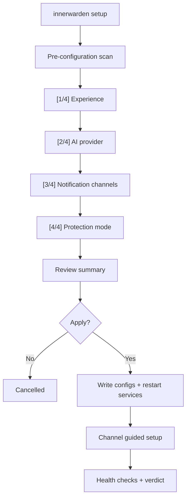

# Setup Wizard

The interactive setup wizard is built into the `innerwarden` CLI binary.

## Run

```bash
# First-time setup (requires root)
sudo innerwarden setup

# Re-run to update channels or settings
sudo innerwarden setup

# Advanced mode (more options, manual confirmations)
sudo innerwarden setup --mode advanced

# Dry-run preview (no root required, no files changed)
innerwarden setup --dry-run
```

## What it does

- Runs an interactive 4-step wizard in the terminal.
- Step 1: Experience profile (simple / technical).
- Step 2: AI provider (Ollama, OpenAI, Anthropic, etc.).
- Step 3: Notification channels (Telegram, Slack, Webhook, Dashboard — multi-select).
- Step 4: Protection mode (watch only / auto-protect).
- Detects existing configuration and offers keep/update per channel.
- Applies changes atomically to `agent.toml` and `agent.env`.
- Runs health checks and reports READY or READY_WITH_GAPS.

## Flow


