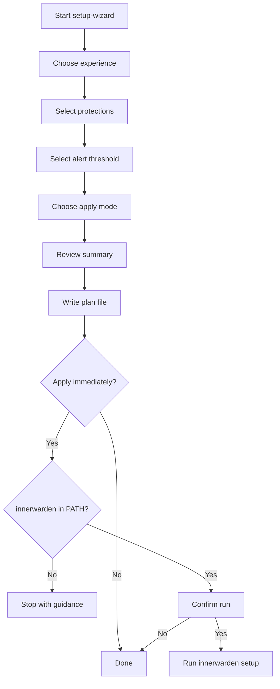

# Setup Wizard Workflow

Use this to plan and approve setup changes step by step without adding build dependencies.

## Run

```bash
./scripts/setup-wizard.sh
```

Theme/contrast options:

```bash
# Auto (default): tries to detect dark/light terminal
IW_WIZARD_THEME=auto ./scripts/setup-wizard.sh

# Force light/dark contrast palette
IW_WIZARD_THEME=light ./scripts/setup-wizard.sh
IW_WIZARD_THEME=dark  ./scripts/setup-wizard.sh

# Disable colors completely (accessibility / maximum compatibility)
NO_COLOR=1 ./scripts/setup-wizard.sh
```

## What it does

- Runs an interactive 4-step wizard via `gum`.
- Captures choices (experience, protections, alert threshold, apply mode).
- Saves a session plan under `docs/internal/setup/plan-YYYYmmdd-HHMMSS.md`.
- Applies only if you explicitly choose **Apply immediately** and confirm.
- Uses adaptive colors for black and white terminals, with manual override.

## Flow



## Approval checklist

- Confirm protections selected are expected for this environment.
- Confirm alert threshold matches desired noise level.
- Confirm apply mode is intentional.
- Confirm rollback owner and contact window.
